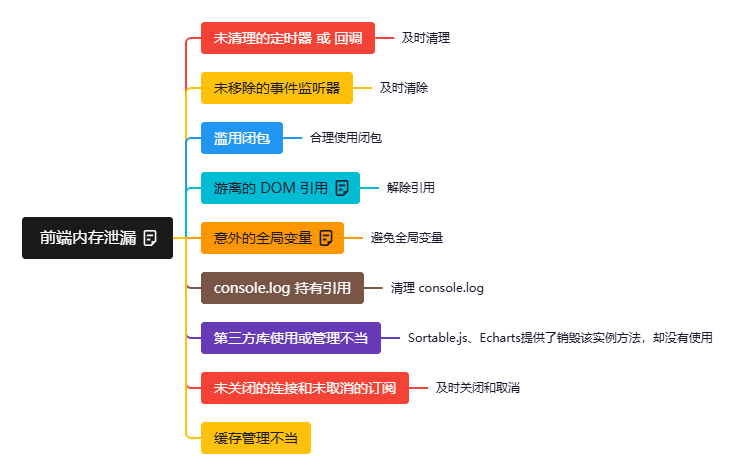

# 前端内存泄漏

**什么是存泄漏**
> 前端内存泄漏指的是 JavaScript 中已分配的内存，由于代码逻辑或引用关系的问题，不再需要却无法被垃圾回收机制回收的情况。随着时间推移，泄漏的内存不断累积，会导致页面性能下降、卡顿、崩溃，甚至影响整个浏览器或设备的稳定性。

**以下是前端开发中常见的内存泄漏原因和场景**

## 1、未清理的定时器 或 回调

+ setInterval() 或 setTimeout() 被调用后，如果其回调函数引用了外部变量（尤其是 DOM 元素或大型对象），并且没有在适当的时候（如组件卸载、页面离开时）使用 clearInterval() 或 clearTimeout() 清除，那么这些定时器会一直存在，其引用的对象也无法被回收。

+ `示例`： 在单页应用(SPA)的组件中启动定时器更新状态，但在组件卸载时忘记清除。

## 2、未移除的事件监听器

+ 使用 addEventListener() 给 DOM 元素（特别是 window, document 等全局对象或动态创建的元素）添加了事件监听器，但在元素被移除（removeChild, innerHTML 清空等）或不再需要时（如组件卸载），没有使用 removeEventListener() 移除监听器。

+ `示例`： 给一个按钮添加点击事件，当这个按钮所在的模态框被关闭并从 DOM 中移除时，如果没有移除监听器，那么监听器函数和它可能引用的外部作用域变量（包括被移除的按钮本身！）都会泄漏。在 SPA 中给全局对象添加监听器，切换路由时忘记移除是常见原因。

## 3、滥用闭包

+ 闭包是 JavaScript 的核心特性，它使得内部函数可以访问外部函数的变量。如果闭包（例如一个事件处理函数、定时器回调、异步操作回调）持有了对外部函数作用域中某个大对象（如 DOM 元素、数组、对象）的引用，并且这个闭包的生命周期很长（比如被挂载到全局变量、DOM 事件上），那么即使外部函数执行完毕，它引用的外部变量也无法被 GC 回收。

+ `示例`： 一个函数内部定义了一个事件处理函数（闭包），这个处理函数引用了函数内部的一个大数组。将事件处理函数绑定到 DOM 元素上，那么该大数组会一直存在，直到事件被移除且没有其他引用

## 4、游离的 DOM 引用

+ 在 JavaScript 中保存了对某个 DOM 元素的引用（例如 let element = document.getElementById('myElement');），即使后来这个元素从实际的 DOM 树中被移除了（element.parentNode.removeChild(element);），只要 JavaScript 变量 element 还存在（例如保存在某个数组、对象或全局变量中），那么这个被移除的 DOM 元素及其关联的事件监听器和子元素占用的内存就不会被释放。

+ `示例`： 维护一个数组来缓存已创建的列表项 DOM 元素，当从页面删除某些项时，只从 DOM 树中移除了，但没有从缓存数组中删除对应的引用。

## 5、意外的全局变量

+ 意外创建的全局变量（如在函数内部忘记写 var, let, const）或故意将大对象赋值给全局变量（window.myHugeData = ...;）。全局变量存在于全局作用域，贯穿整个应用的生命周期，永远不会被 GC 回收。

+ `示例`： function foo() { bar = 'oops'; } (创建了全局变量 bar)。或者 window.cache = {}; 并且不断往里面塞数据而不清理。

## 6、console.log 持有引用

+ 在开发过程中，console.log 打印大型对象、数组或 DOM 元素。浏览器控制台为了便于开发者检查（例如可以展开对象），会保留对这些被打印对象的引用，阻止其被回收。虽然在生产环境 console.log 通常会被移除，但遗漏的 console.log 在生产环境也可能造成泄漏（尤其是在打印大对象时）。

## 7、第三方库使用或管理不当

+ 使用第三方库（如图表库、地图库、富文本编辑器）时，如果库本身存在内存泄漏问题。

+ 更常见的是，没有按照库的要求在实例不再需要时调用其销毁/清理方法（如 destroy(), dispose(), unmount()）。库内部可能创建了 DOM、事件监听器、Web Workers、WebSockets 等资源，如果不主动销毁，这些资源及其关联的 JS 对象就会泄漏。

## 8、未关闭的连接和未取消的订阅 (WebSockets, Observables, Event Emitters)

+ 创建了 WebSocket 连接、订阅了 RxJS Observable、或者使用了 EventEmitter 模式，但在不再需要时（组件卸载、页面离开）没有关闭连接（websocket.close()）或取消订阅（subscription.unsubscribe()）。这些连接或订阅的回调函数可能持有对组件或其他对象的引用，导致泄漏。

## 9、缓存管理不当

+ 实现自定义缓存机制时，如果没有设置合理的过期策略或大小限制，缓存的数据会无限增长，占用越来越多的内存

## 如何排查和避免内存泄漏

使用浏览器开发者工具 (`Chrome DevTools`):

`Performance Monitor`: 实时监控 JS Heap Size、DOM Nodes 等指标，观察是否有持续增长的趋势。

**Memory Profiler(内存分析):**

`Heap Snapshots`: 在不同操作（如打开/关闭组件）前后拍摄堆快照，对比查找持续增长或未被释放的对象及其引用链。

`Allocation instrumentation on timeline`: 实时跟踪内存分配，定位频繁分配且未被回收的对象。

`Performance Recordings`: 记录性能时间线，观察内存使用趋势，并与用户操作关联。

**良好的编码习惯：**

`及时清理`： 对定时器、事件监听器、第三方库实例、订阅、WebSocket 连接等，在它们不再需要时（componentWillUnmount / useEffect cleanup / beforeDestroy / onPageHide 等生命周期或事件中）主动清除、移除、销毁、取消订阅、关闭。

`谨慎使用闭包`： 注意闭包引用了哪些外部变量，评估其生命周期。必要时可以手动解除引用（如将引用置为 null）。

`管理 DOM 引用`： 当 DOM 元素被移除后，确保删除所有指向它的 JavaScript 引用（将其置为 null 或从数组中移除）。

`避免全局变量`： 尽量使用模块作用域、函数作用域或块级作用域变量 (let, const)。必须使用全局状态时，考虑使用状态管理库（如 Redux, Vuex）并注意清理。

`清理 console.log`: 在提交代码前移除或注释掉不必要的 console.log，尤其是打印大型对象时。

`遵循第三方库规范`： 仔细阅读库的文档，了解其资源管理要求，务必在适当时机调用清理方法。

`使用 WeakMap / WeakSet`： 当需要存储对对象的弱引用（即引用不阻止 GC）时，可以使用 WeakMap 和 WeakSet。这常用于存储与对象关联的元数据，而不会阻止对象被回收。

`代码审查`： 在团队协作中，代码审查是发现潜在内存泄漏模式（如忘记清理监听器、定时器）的好方法。

`自动化测试 (可选但推荐)`： 使用类似 Puppeteer 或 Playwright 的工具编写 E2E 测试，结合 DevTools 的 Memory API 或 Performance Monitor，在关键用户流（如多次打开/关闭模态框、导航页面）后检查内存是否稳定。

`总结：` 前端内存泄漏的核心在于 “不需要的对象因为意外的引用而无法被回收”。解决的关键在于意识（了解常见泄漏点）、习惯（及时清理资源、谨慎管理引用）和工具（善用 DevTools 进行检测和分析）。尤其是在构建复杂的单页应用时，内存管理至关重要。

